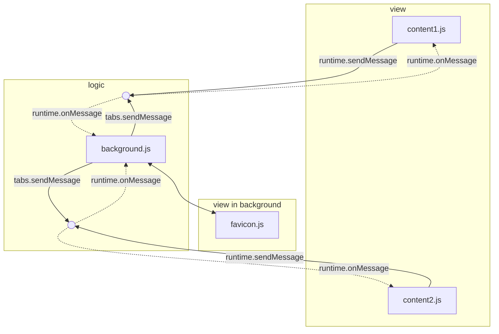
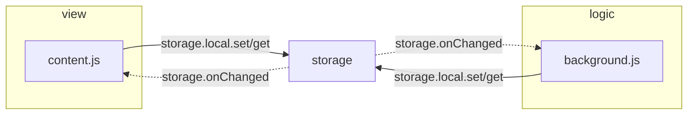
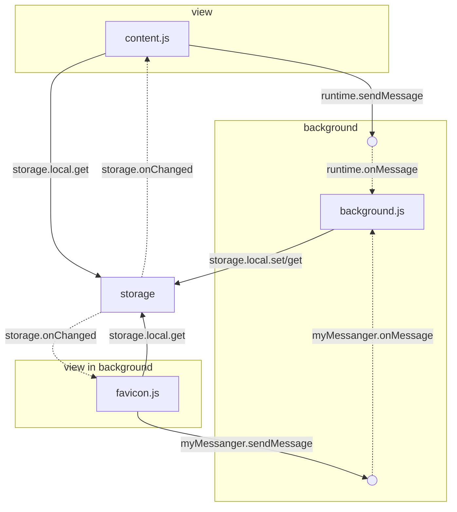

# boilerplate note

## Description

- PC側制御機能も持ったブラウザ拡張機能を作ろう
- スマートフォン向けの拡張機能を作ろう

## manifest

- 今更、古いものに```"manifest_version" : 3```
  - kiwiがサポと終了したのandroidでターゲットにするのはEdge Canary
  - Firefoxで機能的に過不足あってver.2使いたくなるが、android側でEdge Canary使うのでFirefox側をpending

### favicon

```json
{
  "action": { 
    "default_title" : "title", // ホバー時の文字列
    "default_icon" : {         // favicon用icon専用
      "16": "icon/active_16.png", 
      "48": "icon/active_48.png",
      "128": "icon/active_128.png"
    },
    "default_popup" : "popup.html"　// faviconクリック時のpopup設定(設定すると```action.onClicked```はdisable化する)
                                    // 25×25 ～ 800 × 600（高解像度も？）
  },
  "icons": {                     // 管理画面用icon(default_iconが見つからないとfaviconにも使用
    "16": "icon/static_16.png",  // 16x16   : for faviconサイズ
    "48": "icon/static_48.png",  // 48x48   : メインの拡張機能アイコン(管理画面)サイズ
    "128": "icon/static_128.png" // 128x128 : Chromeウェブストアサイズ
                                 // (過不足はスケールダウンで自動補間(スケールアップはしない))
                                 // (高解像度ディスプレイではすべてのアイコンを2倍のサイズに)
  },
}
```

```javascript
// favicon
chrome.action.setTitle()
chrome.action.setIcon()
chrome.action.enable();
chrome.action.disable();

// Badge
let currentText = await chrome.action.getBadgeText({});
await chrome.action.setBadgeText({ text });
let color = await chrome.action.getBadgeBackgroundColor({});
chrome.action.setBadgeBackgroundColor({ color });
```

### import script

```json
{
  "background": {               // service_worker
    "service_worker": "background.js",
    "type" : "module"           // module化
  },
  "content_scripts": [          // content = 読みだしたサイトに注入するscript
    {
      "js": ["content.js"], 
      "matches": ["<all_urls>"],
      "run_at": "document_idle" // document_start : cssプロパティ読込後、DOM構築/scripts実行前
                                // document_end   : DOM構築後、画像などサブリソースが読込前
                                // document_idle  : document_endからwindow.onloadイベントまでの間の"任意"
                                // document_idle + onreadystatechange() : 一番遅い
    }
  ],
  "web_accessible_resources": [ // content.jsで参照するscript
    {
      "resources": [ "func.mjs",],
      "matches": ["<all_urls>"]
    }
  ]
}
```

- background.jsだと```import { } from "../hoge.js"```
  - ```manifest.json``での登録不要
  - 古い書き方```importScripts(hoge.js);```
- content.jsだと```const { } = await import(chrome.runtime.getURL("hoge"));```  
  - ```manifest.json```での登録必要

#### CDNのjsを読んだ時の動作

CDNに公開されてるライブラリでよく使われる以下の様なブロックで、```window[exportName] = Hoge;```を呼び出していた

```javascript
/* js-yam内部 */
if (typeof define === 'function' && define.amd) {
  define(function() { return Hoge; });
} else if (typeof module != 'undefined' && module.exports) {
  module.exports = Hoge;
} else {
  window[exportName] = Hoge; // content.jsから呼び出した際、この行を呼び出してる
}
```

```javascript
/* js-yam読み込み*/
const _ = await import(chrome.runtime.getURL("js/js-yaml/4.1.0/js-yaml.min.js"));
console.log("yaml", jsyaml.dump({"a" : 20}))  // Globalに展開されたjsyamlオブジェクトを参照
```

#### onreadystatechange()の実装例

```js
/* content.js 1*/
document.onreadystatechange = () => {
  if (document.readyState === "interactive") { foo_init(); }
};
/* content.js 2*/
document.addEventListener("readystatechange", (event) => {
  switch (event.target.readyState) {
    case "loading": // The document is loading.
      break;
    case "interactive": {
      // The document has finished loading and we can access DOM elements.
      // Sub-resources such as scripts, images, stylesheets and frames are still loading.
      bar_addDOM();
      break;
    }
    case "complete": // The page is fully loaded.
      break;
  }
});
```

## LOGIC

### メッセージ戦略 (view-model間)

おおまかに




- 疎結合にしたい
  - view(content.js)が存在してるかいちいち気にしたくない
  - pushとpull混ぜたくない
- background.jsは非永続でidelするとローカル変数が揮発する
  - 変数はstorageに保持する必要がある
- tabs.sendMessage / runtime.sendMessage
  - tab全部を検索して投げるの大変[[*]](#sendNotification)[[*]](#opennewtab)
  - background.jsからbackground.js(View要素)にメッセージ投げれない
- sendMessageの注意点
  - async (message, sender, sendResponse)にすると他のリスナーをブロックしてしまうので使用しない
  - Chromeのバグ1185241[[link]](https://developer.mozilla.org/en-US/docs/Mozilla/Add-ons/WebExtensions/API/runtime/onMessage#sending_an_asynchronous_response_using_sendresponse)
    - 解決されるまで、```return Promise```は使用できない。
    - 代わりにtrue を返して```sendResponse```を使用
    - ```sendResponse```が有効なリスナは最初にtrueを返却した関数[[*]](#asyncsendMessage)

みたいな部分を考えて以下のような構成に



### メッセージ戦略 (対PC)

- native messagingはレジストリへの登録が面倒なのでfetchのPOSTを使用
- コマンドラインの文字コード解決するのが面倒なのでサーバはps1を使用
- コマンドラインでのデータのやり取りはJSONCを仕様（ほんとはyaml使いたい
  - Install-Module -Name powershell-yaml

## UI

### ファイルダイアログ

background.jsではwindow.showOpenFilePickerが使用できないが、active tabかpopupを介してワンアクションで使用できるか

- popup
  - keyeventが発火ないので呼び出し直後に出力できない
  - 小さなサイズでもpopupが表示される
- active tab
  - こちらもクリックの履歴が残ってないと発火しないようす（発火するのはそもそもバグでは？
  - chrome://だと呼び出せない

であまりうまくいかない。おとなしく設定画面つくるべし

```js
const tabs = await chrome.tabs.query({ });
const [filteredTab] = tabs.filter(tab => 
  !tab.url.startsWith('chrome://')
);
if(filteredTab) {
  console.log(filteredTab)
  const id = filteredTab.id;
  await chrome.scripting.executeScript({
    target: { tabId : id },
    func : async () => {
      const [handle] = await window.showOpenFilePicker({
        types: [
          {
            description: "Config File",
            accept: { "text/plain": [".json", ".yaml", ".yml"], },
          },
        ],
      });
      const file = await handle.getFile();
      const text = await file.text();
      // chrome.runtime.sendMessage({ path: file.name, body: text }, (response) => { console.log("response from background:", response); });
    }
  });
} else {
  console.log(filteredTab)
}
```

### コンテキスト

ファイルダイアログと同様にセキュリティ上の制限がある。

- イベントを非同期にして発生を遅らせれない
- コード上から呼び出しできない

など制限があり右クリックイベントに絡めて設計できない。tabのchangeアクションで書き換え。

## Other

- ```url.parse```はkiwiでエラー出たので```new URL```を使用

## snippet

#### async sendMessage

```js
/* in content.js */
chrome.runtime.onMessage.addListener((message, sender, sendResponse) => {
  sendResponse(true);
  retrun true;
});

/* in background.js */
export function sendMessage(action, state) {
  chrome.runtime.sendMessage({ 
    url : location.href,
    action : action,
    payload : state
  });
}

export async function sendMessageAsync(action, state){
  return new Promise((resolve) => {
    chrome.runtime.sendMessage({ 
      url : location.href,
      action : action,
      payload : state
    }).then((res)=> resolve(res) );
  });
}
```

#### sendNotification

```javascript
/* in content.js */
chrome.runtime.onMessage.addListener((message, sender, sendResponse) => {
  sendResponse(true);
  retrun true;
});

/* in background.js */
export async function sendNotification(tabId, key){
  let targetTabs;
  if(tabId){
    targetTabs = await chrome.tabs.get(tabId);
  }else{
    targetTabs = await chrome.tabs.query({ url: "*://*/*" }); // すべてのURLのタブ    
  }
  for (const tab of targetTabs) {
    (async ()=>{
      try{
        // content.js がまだ読み込まれていない可能性があるので、明示的に実行
        const id = tab.id;
        await chrome.scripting.executeScript({
           target: { id },
           files: ["content.js"]
        });
        const res = await chrome.tabs.sendMessage(id, key);
      }catch(err){
      }
    })();
  }
}
```

#### open newtab

```javascript
async function openNewTab(target, params) {
  const [firsttab] = await chrome.tabs.query({ url : target });
  // chrome.tabs.query({ }).findIndex(n => n.url === target)
  // chrome.tabs.query({ }).filter(tab => tab.url == target);
  if(firsttab) {
    await chrome.tabs.update(firsttab.id, { active: true })
    await chrome.tabs.sendMessage(firsttab.id, { params });
  } else {
    const newtab = await chrome.tabs.create({ url: target });
    const onUpdatedListener = async (updatedTabId, changeInfo) => {
      if (updatedTabId === newtab.id && changeInfo.status === "complete") {
        await chrome.tabs.sendMessage(newtab.id, { params });
        await chrome.tabs.onUpdated.removeListener(onUpdatedListener);
      }
    };
    chrome.tabs.onUpdated.addListener(onUpdatedListener);
  }
}
```

#### UI click event

```js
document.addEventListener("dblclick", (event) => {
  console.log("dblclick")
  const flg = confirm("dblclick");
  if(flg) {
    alert("yes")
  } else {
    alert("no")
  }
});

let touchTimer;
document.addEventListener("touchstart", (event) => {
  touchTimer = setTimeout(() => {
    const flg = confirm("touch");
    if(flg) {
      alert("yes")
    } else {
      alert("no")
    }
  }, 500);
});
document.addEventListener("touchend", () => {
  clearTimeout(touchTimer);
});
```